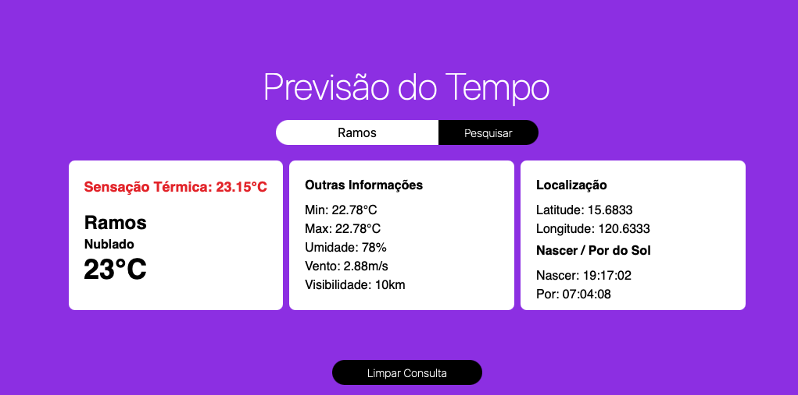

# Clima Tempo App 

Before leaving home, why not check if you need an umbrella or sunscreen?

OpenWeather provides an API that allows real-time access to weather data for your city. Using the Axios library to fetch and filter information, this simple app displays the forecast clearly and efficiently. Built with Vite and React, it features Tailwind CSS styling to ensure a modern and responsive interface.

- **API**: OpenWeather
- **Biblioteca HTTP**: Axios
- **Estilização e Responsividade**: Tailwind CSS V3

- **Link para o App**: [Clima Tempo App](https://clima-tempo-app.netlify.app)

